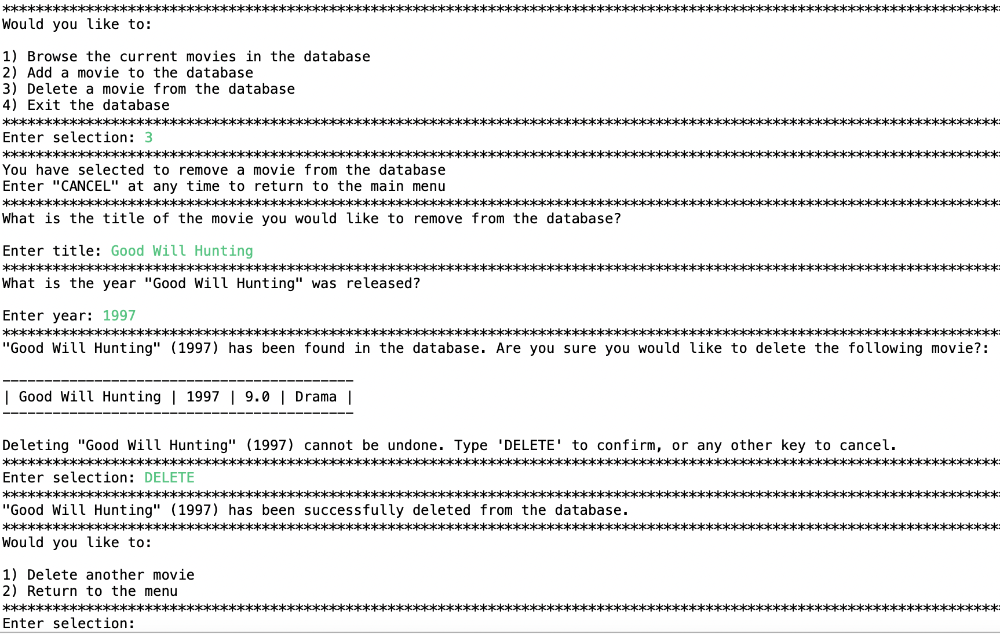

# Movie Database
Movie database that keeps track of movies with ratings, genres, and other relevant information.

**Welcome Screen**

Greets users and offers several options to interact with the database: browse the current movies, add a new movie, delete a movie, or exit the database.

**Browse Movie Screen:**

Allows users to sort movies by one of 5 options, and outputs the current movies in the database in the sorted order.

**Add Movie Screen:**

Allows user to add a movie to database: If invalid input is given (ex. a word instead of a year), the program prompts the user to input valid input. 

**Remove Movie Screen:**

Allows user to remove a movie from the database: If invalid input is given (ex. a word instead of a year), the program prompts the user to input valid input. The program double checks with the user that they definitely want to remove the movie. 

**Goodbye Screen:**

Displays a farewell message.

